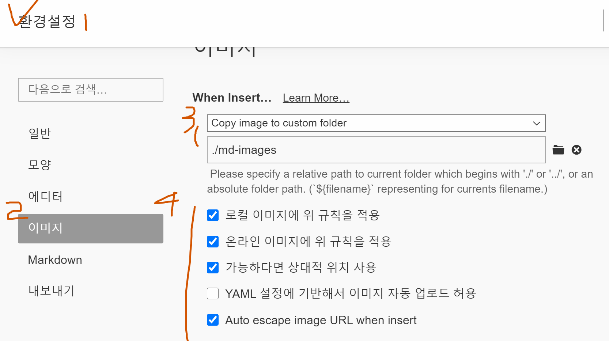

# 마크다운문법

## 제목(heading)

문서의 구조를 잡기 위해 활용된다. 제목의 레벨에 맞춰 `#`으로 표현한다. 

### 제목3

#### 제목4

##### 제목5

###### 제목6

## 목록

* `(* 띄어쓰기)` 순서가 없는 목록

* 순서가 없습니다
  * `tab`해서 글머리 옮길 수 있다
  
* `shift+tab` 해서 글머리 제자리로

  `enter + enter` 하면 나가진다

1. 순서가 있는 목록

   1. tab하면 글머리 옮겨짐

2. shift + tab해서 글머리 제자리로

   

## 코드 블록

인라인 코드 블록 `def` (```세번하고 언어 쓰기)

```python
# 주석
print('hello')
def foo():
    return True
```

html 예시

```html
<!-- 주석 -->
<h1>
    hello
</h1>
```

## 표

| 순번 | 이름   | 비고 |
| ---- | ------ | ---- |
| 1    | 홍길동 |      |
| 2    | 김철수 |      |
| 3    | 박영희 |      |

본문- 표- 표 삽입

`ctrl + /` 해서 표가 어떤 문법인지 볼 수 있다


## 이미지


* Typora 설정을 통해 이미지를 상대 경로로 복사하여 관리할 수 있도록 아래와 같이 설정한다. 

  


## 링크

[구글](https://google.com) 링크 ->대괄호, 소괄호 구분

[폴더](./md-images)에 마크다운에 활용된 이미지가 있다.


## 기타

*기울임(이탤릭체)*  i (* 1개)

**굵게(볼드체) ** (** 2개)

~~취소선~~  <----  (~~ 2개 물결)

---


